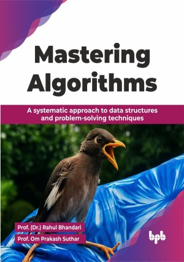

# Mastering Algorithms

A systematic approach to data structures and problem-solving techniques.

This is the repository for [Mastering Algorithms
](https://bpbonline.com/products/mastering-algorithms?_pos=1&_sid=d3a067561&_ss=r&variant=44722487722184?variant=44722487722184),published by BPB Publications.

## About the Book
Algorithms are the foundational language of computing, driving everything from efficient search engines to complex machine learning. Acquiring them is essential for any developer or computer scientist seeking to build high-performance, scalable software. 

The book explores the fundamental data structures like arrays, stacks, queues, linked lists, hashing, and various trees, as well as binomial and Fibonacci heaps. With this foundation, you will explore a wide range of sorting and searching algorithms, from simple methods to more advanced techniques like radix sort and exponential search. You will gain a deep understanding of general methods and applications of divide and conquer, greedy algorithms, dynamic programming, backtracking, and branch and bound, each explained with classic examples.

By the end of this book, you will possess the knowledge and skills needed to tackle challenges head-on, whether in academia or the ever-evolving landscape of technology. You will be prepared for the challenges of building robust software in any professional setting. 

## What You Will Learn
• Analyze algorithm and program performance metrics.

• Master fundamental data structures for efficiency.

• Understand sorting algorithms like quick sort, merge sort.

• Explore searching techniques like binary search.

• Apply divide and conquer for problem-solving.

• Design greedy algorithms for optimization tasks.

• Implement graph algorithms for network analysis.
